# 🏥 Healthspan Vista - Hospital Management System

<div align="center">


**Your Complete Healthcare Horizon** ✨

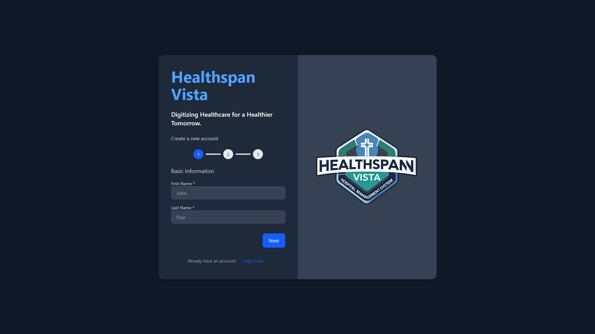
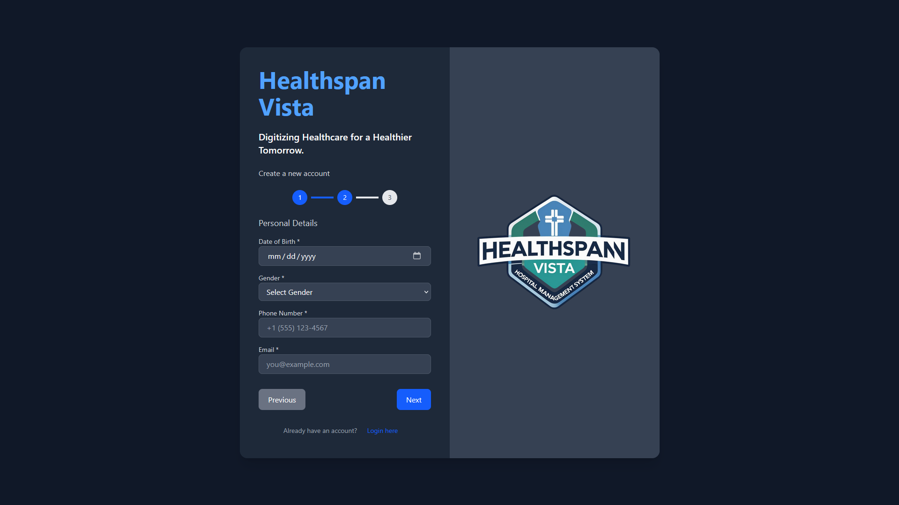
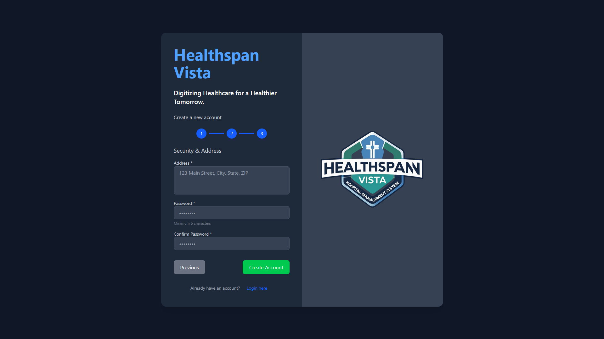
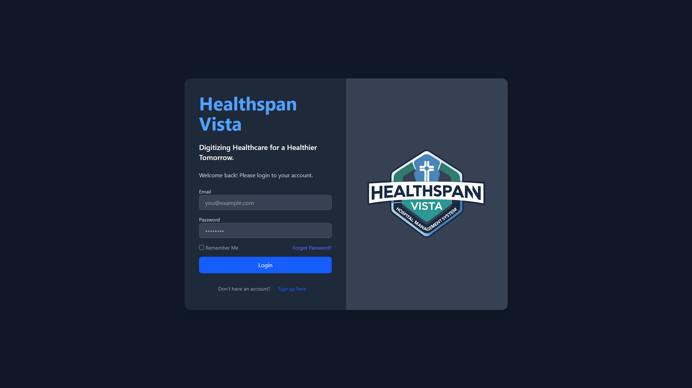
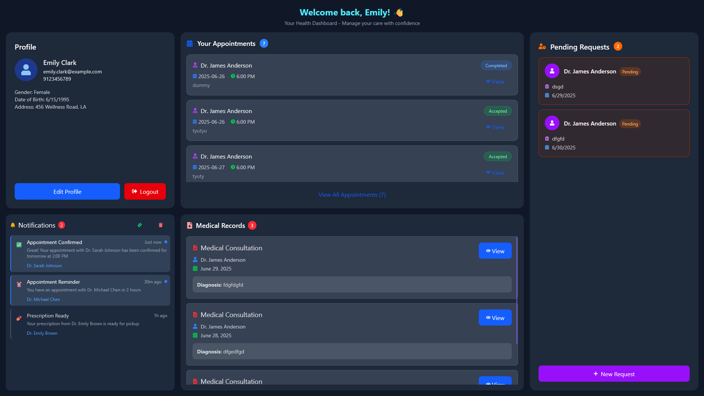
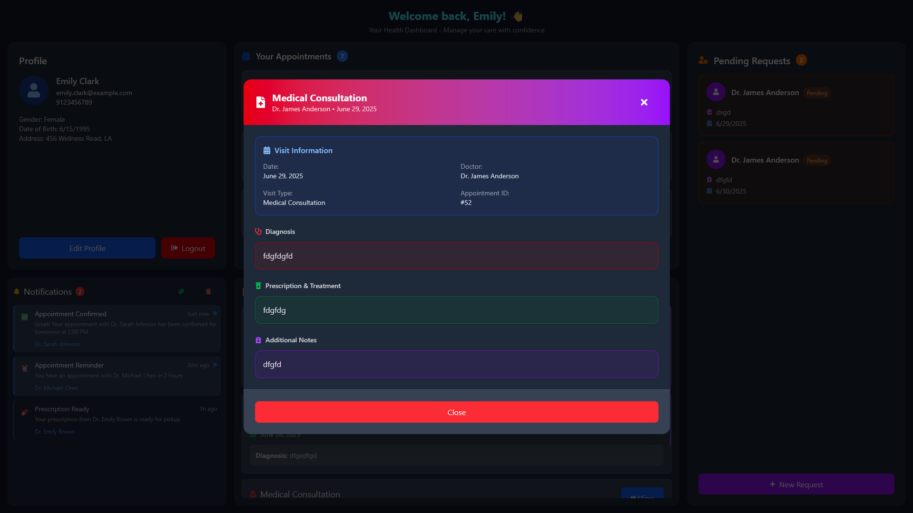
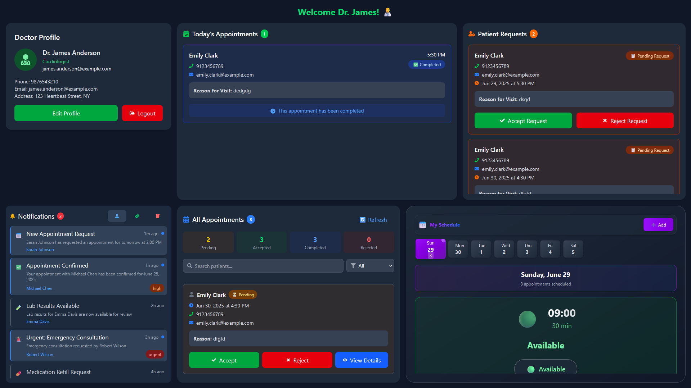
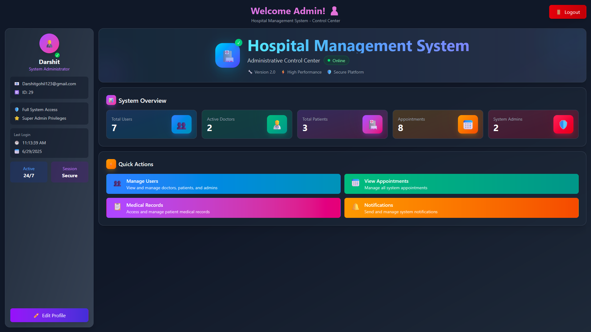
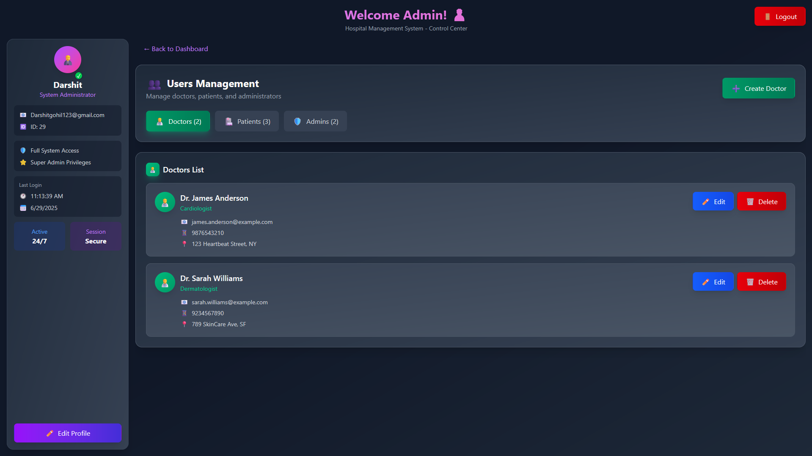
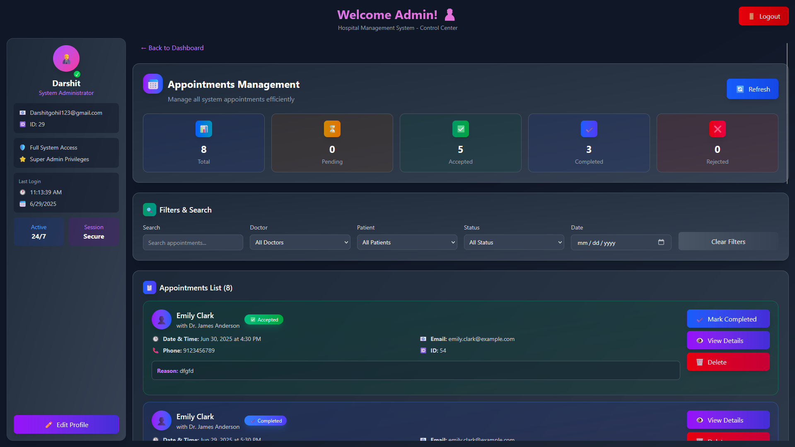
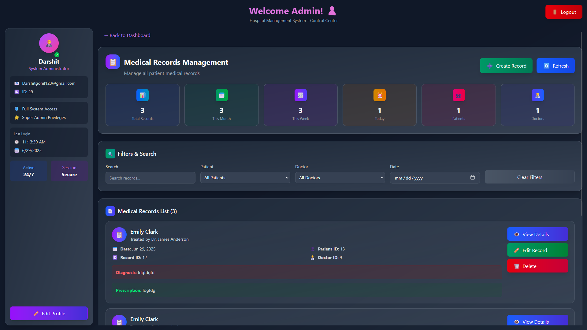
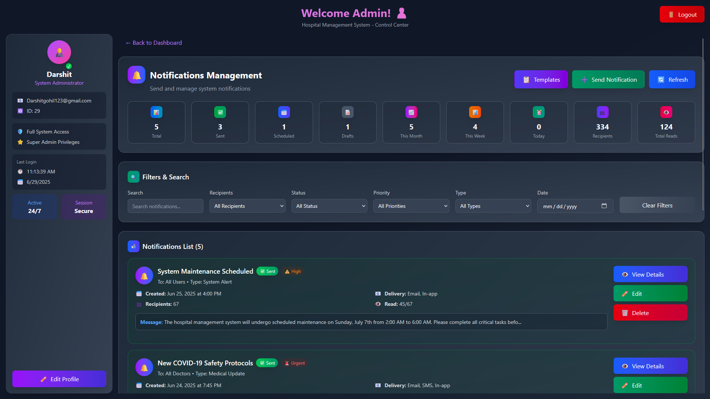


[](https://reactjs.org/)
[](https://dotnet.microsoft.com/)
[](https://www.microsoft.com/sql-server)
[](https://tailwindcss.com/)

[📖 Documentation](#-project-structure) • [🗄️ Database Setup](#-database-setup) • [🐛 Report Bug](https://github.com/Darshit456/HMS_Frontend/issues) • [💡 Request Feature](https://github.com/Darshit456/HMS_Frontend/issues)


---

*See Beyond. Care Better. A modern hospital management system that provides a comprehensive view of healthcare operations through an intuitive web interface.*

</div>

## 🌟 Why Healthspan Vista?

> **"Where Health Meets Insight - Healthspan Vista provides the complete healthcare horizon you need."**

Modern healthcare management requires a panoramic view of all operations. Healthspan Vista delivers exactly that - a comprehensive, birds-eye view of your entire healthcare ecosystem.

### 🎯 The Problem We Solve
- 😩 **Fragmented healthcare data** scattered across multiple systems
- 📱 **Limited visibility** into patient journeys and outcomes
- 🔒 **Security concerns** with sensitive medical data
- 📊 **Poor communication** between different healthcare stakeholders
- ⏰ **Inefficient workflows** that delay patient care

### 💡 Our Solution
✅ **Panoramic healthcare view** - see everything at a glance  
✅ **Integrated workflows** across all departments  
✅ **Enterprise-grade security** with comprehensive access control  
✅ **Real-time insights** for better decision making  
✅ **Streamlined operations** that put patients first

---

## 🎬 Demo Videos

*Experience Healthspan Vista in action through our comprehensive demo videos*
<h2 align="center">🎬 Healthspan Vista Demo Video</h2>
<p align="center">
  <a href="https://youtu.be/cZ4-nkHM4n0" target="_blank">
    
  </a>
</p>
*Videos will showcase real-world usage scenarios and highlight key functionalities*

---

## ✨ Features That Make Us Special

<div align="center">

| 🏷️ **Feature Category** | 🔥 **What's Included** | 💪 **Why It Matters** |
|:---|:---|:---|
| **🔐 Vista Security** | JWT-based secure login, Role-based access control | Your data stays protected |
| **👥 Vista Roles** | Patient, Doctor, Admin dashboards | Everyone gets their personalized vista |
| **📱 Vista Mobile** | Mobile-first approach, Works on any device | Healthcare vista on the go |
| **⚡ Vista Updates** | Live notifications, Instant data sync | Real-time healthcare horizon |
| **🎨 Vista Design** | Beautiful gradients, Smooth animations | Delightful visual experience |
| **📊 Vista Analytics** | Medical records, Appointments, User profiles | Complete healthcare overview |
| **🗄️ Vista Database** | SQL Server with backup/restore | Enterprise-grade data vista |

</div>

---

## 🏗️ System Architecture

<div align="center">

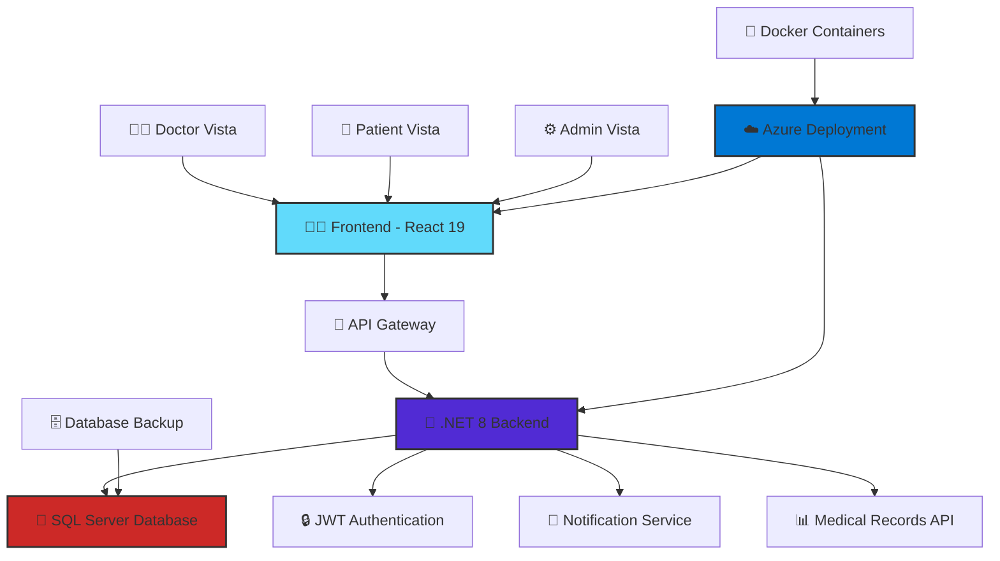

</div>

---

## 🚀 Quick Start Guide

### ⚡ Frontend Setup

```bash
# Clone the frontend repository
git clone https://github.com/Darshit456/HMS_Frontend.git
cd HMS_Frontend

# Install dependencies
npm install

# Start development server
npm run dev
```

### 🔧 Backend Setup

```bash
# Clone the backend repository
git clone https://github.com/Darshit456/Hospital_Management_System.git
cd Hospital_Management_System

# Restore .NET packages
dotnet restore

# Configure database (see Database Setup section)
# Update connection string in appsettings.json

# Start the API server
dotnet run
```

**🎉 Your Healthspan Vista development environment is ready! Frontend runs on `http://localhost:5173`**

---

## 🗄️ Database Setup

### 📋 Prerequisites
- **SQL Server 2019** or later (Express Edition works)
- **SQL Server Management Studio (SSMS)**
- **Windows Authentication** or **SQL Server Authentication**

### 🚀 Quick Database Setup

1. **Download Database Backup**
   - Navigate to `Hospital_Management_System/Database/`
   - Download `HospitalManagement.bak.zip`
   - Extract to accessible location (e.g., `C:\DatabaseBackups\`)

2. **Restore Database**
   ```sql
   -- Using SQL Server Management Studio
   -- Right-click Databases → Restore Database → Select backup file
   
   -- OR using T-SQL
   RESTORE DATABASE [HospitalManagementDB] 
   FROM DISK = 'C:\DatabaseBackups\HospitalManagement.bak'
   WITH REPLACE;
   ```

3. **Update Connection String**
   ```json
   // In appsettings.json
   {
     "ConnectionStrings": {
       "DefaultConnection": "Server=localhost\\SQLEXPRESS;Database=HospitalManagementDB;Trusted_Connection=true;TrustServerCertificate=true;"
     }
   }
   ```

4. **Verify Setup**
   ```sql
   USE HospitalManagementDB;
   SELECT COUNT(*) FROM Users; -- Should return sample users
   ```

### 📊 Database Schema
- **Users**: Authentication and role management
- **Patients**: Patient profiles and information
- **Doctors**: Doctor details and specializations
- **Appointments**: Scheduling and management
- **MedicalRecords**: Patient medical history
- **Admins**: Administrative user details

**📖 For detailed database setup instructions, see [Database/README.md](https://github.com/Darshit456/Hospital_Management_System/tree/main/Database)**

---

## 📦 Complete Installation Guide

### 🛠️ Prerequisites

- **Node.js** `>=18.0.0` 📗
- **npm** `>=8.0.0` or **yarn** `>=1.22.0` 📦
- **.NET 8 SDK** 🔷
- **SQL Server 2019+** or **SQL Server Express** 🗄️

### 🔧 Step-by-Step Installation

#### 1️⃣ **Clone Repositories**
```bash
# Create project directory
mkdir healthspan-vista-project
cd healthspan-vista-project

# Clone frontend
git clone https://github.com/Darshit456/HMS_Frontend.git frontend

# Clone backend
git clone https://github.com/Darshit456/Hospital_Management_System.git backend
```

#### 2️⃣ **Frontend Setup**
```bash
cd frontend

# Install dependencies
npm install

# Create environment file
echo "VITE_API_URL=https://localhost:7195" > .env.local
echo "VITE_APP_NAME=Healthspan Vista" >> .env.local
```

#### 3️⃣ **Backend Setup**
```bash
cd ../backend

# Restore packages
dotnet restore

# Setup database (follow Database Setup section above)
# Update appsettings.json with your connection string
```

#### 4️⃣ **Run Development Servers**
```bash
# Terminal 1 - Frontend
cd frontend
npm run dev

# Terminal 2 - Backend  
cd backend
dotnet watch run
```

#### 5️⃣ **Test the Application**
- Frontend: `http://localhost:5173`
- Backend API: `https://localhost:7195`
- **Swagger UI**: `https://localhost:7195/swagger` (for API testing)
- Test login with sample credentials (see Database section)

---

## 👥 User Roles & Dashboards

### 🏥 **Admin Vista** - Complete System Control
<details>
<summary>🔍 <strong>Click to see Admin Vista features</strong></summary>

**🎛️ Administrative Powers:**
- 👨‍⚕️ **User Management**: Create, edit, delete doctors, patients, and admins
- 📊 **System Analytics**: View comprehensive statistics and reports
- 📋 **Medical Records**: Access and manage all patient records
- 📅 **Appointment Oversight**: Monitor and manage all appointments
- 🔔 **Notification Center**: Send system-wide announcements
- ⚙️ **System Settings**: Configure application parameters

**🔑 Sample Admin Login:**
- Username: `admin`
- Password: `admin123`

</details>

### 👨‍⚕️ **Doctor Vista** - Medical Excellence
<details>
<summary>🔍 <strong>Click to see Doctor Vista features</strong></summary>

**🩺 Medical Tools:**
- 📅 **Vista Schedule**: View and manage daily appointments
- 🔄 **Patient Requests**: Accept or decline appointment requests
- 📋 **Medical Records**: Create and update patient medical records
- 👤 **Profile Management**: Update personal and professional information
- 🔔 **Real-time Notifications**: Stay updated with important alerts
- 📊 **Appointment History**: Track completed and upcoming appointments

**🔑 Sample Doctor Login:**
- Username: `doctor1`
- Password: `doctor123`

</details>

### 👤 **Patient Vista** - Healthcare at Your Fingertips
<details>
<summary>🔍 <strong>Click to see Patient Vista features</strong></summary>

**🏥 Patient Tools:**
- 📅 **Appointment Booking**: Request appointments with preferred doctors
- 📋 **Medical Records**: View personal medical history and records
- 👤 **Profile Management**: Update personal information and settings
- 🔔 **Health Notifications**: Receive appointment reminders and updates
- 📞 **Doctor Communication**: Track appointment status and responses
- 📊 **Health Dashboard**: Overview of medical status and appointments

**🔑 Sample Patient Login:**
- Username: `patient1`
- Password: `patient123`

</details>

---

## 🎨 UI/UX Design Philosophy

### 🌈 **Vista Design System**

Our design system is built on the principle of **"Healthcare should provide clarity, not complexity"**.

#### 🎨 **Vista Color Palette**
```css
/* Primary Colors */
--vista-blue: #4F46E5     /* Trust & Reliability */
--vista-purple: #7C3AED   /* Innovation & Care */
--vista-emerald: #10B981  /* Health & Growth */

/* Gradient Magic */
--gradient-primary: linear-gradient(135deg, #4F46E5 0%, #7C3AED 100%)
--gradient-success: linear-gradient(135deg, #10B981 0%, #059669 100%)
--gradient-warning: linear-gradient(135deg, #F59E0B 0%, #D97706 100%)
```

#### ✨ **Vista Animation System**
- **🌊 Smooth Transitions**: 300ms ease-out for all interactions
- **🎭 Micro-interactions**: Hover effects that provide instant feedback
- **📱 Loading States**: Beautiful loading animations that reduce perceived wait time
- **🎪 Page Transitions**: Seamless navigation between sections

#### 📱 **Responsive Vista Strategy**
```javascript
// Breakpoint System
const breakpoints = {
  sm: '640px',   // Mobile Vista
  md: '768px',   // Tablet Vista
  lg: '1024px',  // Desktop Vista
  xl: '1280px'   // Large Vista
}
```

---

## 🔌 API Integration

### 🌐 **RESTful API Design**

Our API follows RESTful principles with comprehensive endpoint coverage:

#### 🔐 **Authentication & User Management**
```javascript
// Authentication
POST   /api/User/login                    // User authentication
GET    /api/User/profile                  // Get user profile

// Admin Management
GET    /api/User/all-admins              // Get all admin users
POST   /api/User/create-admin            // Create new admin user
PUT    /api/User/update-admin/{id}       // Update admin details
DELETE /api/User/delete-admin/{id}       // Delete admin user
DELETE /api/User/delete/{id}             // Delete any user
```

#### 👤 **Patient Management**
```javascript
POST   /api/Patient/register             // Patient registration
GET    /api/Patient/{id}                 // Get patient by ID
GET    /api/Patient/All                  // Get all patients
PATCH  /api/Patient/update/{id}          // Update patient info
DELETE /api/Patient/Delete/{id}          // Delete patient
```

#### 👨‍⚕️ **Doctor Management**
```javascript
POST   /api/Doctor/register              // Doctor registration
GET    /api/Doctor/All                   // Get all doctors
GET    /api/Doctor/{id}                  // Get doctor by ID
PATCH  /api/Doctor/{id}                  // Update doctor info
DELETE /api/Doctor/Delete/{id}           // Delete doctor
```

#### 📅 **Appointment System**
```javascript
GET    /api/Appointment                  // Get appointments
GET    /api/Appointment/doctor/{doctorId} // Get doctor's appointments
POST   /api/Appointment/Create           // Create new appointment
PUT    /api/Appointment/{appointmentId}/UpdateStatus // Update appointment status
DELETE /api/Appointment/{appointmentId}/Delete       // Delete appointment
```

#### 🔔 **Notification System**
```javascript
GET    /api/Notification/my-notifications        // Get user notifications
POST   /api/Notification/send-appointment-notification // Send appointment notification
POST   /api/Notification/send-status-change      // Send status change notification
POST   /api/Notification/mark-read               // Mark notification as read
POST   /api/Notification/mark-all-read           // Mark all notifications as read
POST   /api/Notification/test                    // Test notification system
DELETE /api/Notification/clear-all               // Clear all notifications
```

### 🔒 **Security Implementation**

#### JWT Authentication Flow
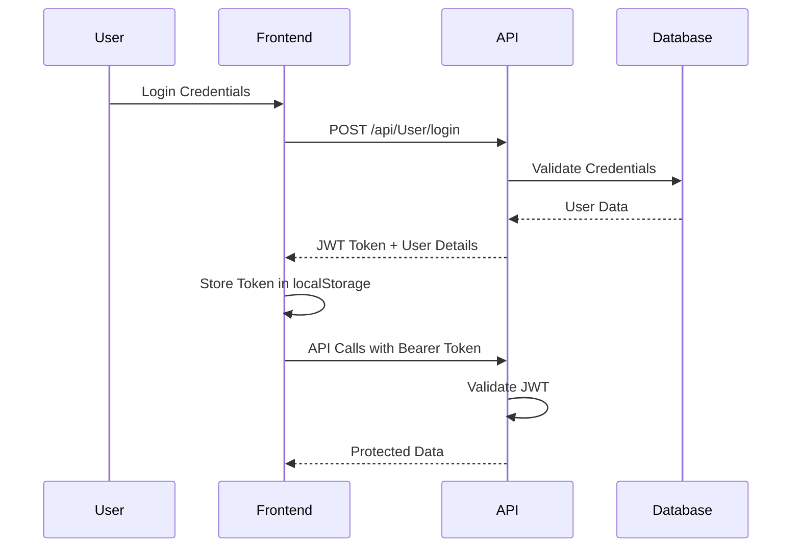

---

## 📊 Project Structure

### 📁 **Frontend Architecture (HMS_Frontend)**

```
HMS_Frontend/
├── 📁 public/                 # Static assets
├── 📁 src/
│   ├── 📁 components/         # Reusable UI components
│   ├── 📁 pages/             # Page components
│   │   ├── 📁 Dashboard/
│   │   │   ├── 📁 Admin/     # Admin vista components
│   │   │   ├── 📁 Doctor/    # Doctor vista components
│   │   │   └── 📁 Patient/   # Patient vista components
│   │   └── 📁 Login/         # Authentication pages
│   ├── 📁 services/          # API integration layer
│   │   ├── 📁 Admin/         # Admin-specific APIs
│   │   ├── 📁 Doctor/        # Doctor-specific APIs
│   │   └── 📄 *.js           # General API services
│   ├── 📁 routes/            # React Router configuration
│   ├── 📁 assets/            # Images, SVGs, etc.
│   ├── 📄 App.jsx            # Main application component
│   ├── 📄 main.jsx           # Application entry point
│   └── 📄 index.css          # Global styles
├── 📄 package.json           # Dependencies and scripts
├── 📄 tailwind.config.js     # Tailwind CSS configuration
├── 📄 vite.config.js         # Vite build configuration
└── 📄 README.md              # Frontend documentation
```

### 🏥 **Backend Architecture (Hospital_Management_System)**

```
Hospital_Management_System/
├── 📁 Controllers/           # API controllers
│   ├── 📄 UserController.cs
│   ├── 📄 PatientController.cs
│   ├── 📄 DoctorController.cs
│   └── 📄 AppointmentController.cs
├── 📁 Models/               # Data models
│   ├── 📄 User.cs
│   ├── 📄 Patient.cs
│   ├── 📄 Doctor.cs
│   └── 📄 Appointment.cs
├── 📁 Services/             # Business logic
├── 📁 Database/             # Database files
│   ├── 📄 HospitalManagement.bak.zip
│   └── 📄 README.md
├── 📄 appsettings.json      # Configuration
├── 📄 Program.cs            # Application entry point
└── 📄 README.md             # Backend documentation
```

### 🎯 **Key Technologies & Dependencies**

#### 🛠️ **Frontend Technologies**
| Technology | Version | Purpose |
|:---|:---:|:---|
| **React** | `19.0.0` | 🔧 Frontend framework |
| **Vite** | `6.2.0` | ⚡ Build tool & dev server |
| **Tailwind CSS** | `4.1.3` | 🎨 Utility-first CSS framework |
| **React Router** | `7.5.0` | 🗺️ Client-side routing |
| **Axios** | `1.9.0` | 🌐 HTTP client for API calls |

#### 🏥 **Backend Technologies**
| Technology | Version | Purpose |
|:---|:---:|:---|
| **.NET** | `8.0` | 🔧 Backend framework |
| **SQL Server** | `2019+` | 🗄️ Database management |
| **Entity Framework** | `8.0` | 📊 Data access layer |
| **JWT** | `Latest` | 🔐 Authentication tokens |

---

## 🔒 Security Features

### 🛡️ **Vista Security Layers**

#### 1️⃣ **Authentication & Authorization**
- 🔐 **JWT Token-based Authentication**
- 👥 **Role-based Access Control (RBAC)**
- ⏰ **Token Expiration Management**
- 🔄 **Secure password hashing**

#### 2️⃣ **Data Protection**
- 🔒 **HTTPS Encryption** for all API communications
- 🛡️ **Input Validation** on both client and server
- 🚫 **XSS Protection** with sanitized outputs
- 🔐 **CSRF Protection** with proper token handling

#### 3️⃣ **Database Security**
- 🗄️ **SQL Server Authentication**
- 🔒 **Encrypted connections**
- 📊 **Regular backup strategy**
- 🛡️ **Role-based database access**

---

## 🚀 Development Workflow

### 💻 **Development Commands**

```bash
# Frontend Commands
npm run dev          # Start development server
npm run build        # Build for production
npm run preview      # Preview production build
npm run lint         # Lint code

# Backend Commands
dotnet run           # Start API server
dotnet watch run     # Start with hot reload
dotnet build         # Build project
dotnet test          # Run tests
```

### 🔄 **Git Workflow**

```bash
# Feature development
git checkout -b feature/appointment-system
git add .
git commit -m "✨ Add appointment booking functionality"
git push origin feature/appointment-system

# Create pull request on GitHub
```

### 📝 **Commit Convention**

We follow conventional commits:

- ✨ `feat:` New features
- 🐛 `fix:` Bug fixes
- 📚 `docs:` Documentation
- 💄 `style:` UI/styling changes
- ♻️ `refactor:` Code refactoring
- ⚡ `perf:` Performance improvements
- 🧪 `test:` Adding tests

---

## 🌐 Environment Configuration

### ⚙️ **Frontend Environment Variables**

Create `.env.local` in the frontend directory:

```bash
# API Configuration
VITE_API_URL=https://localhost:7195
VITE_API_TIMEOUT=30000

# Application Settings
VITE_APP_NAME=Healthspan Vista
VITE_APP_VERSION=1.0.0

# Development Settings
VITE_DEV_MODE=true
VITE_SHOW_LOGS=true
```

### ⚙️ **Backend Configuration**

Update `appsettings.json`:

```json
{
   "ConnectionStrings": {
      "DefaultConnection": "Server=localhost\\SQLEXPRESS;Database=HospitalManagementDB;Trusted_Connection=true;TrustServerCertificate=true;"
   },
   "JwtSettings": {
      "SecretKey": "YourSecretKeyHere",
      "Issuer": "HealthspanVista",
      "Audience": "VistaUsers",
      "ExpiryMinutes": 60
   },
   "Logging": {
      "LogLevel": {
         "Default": "Information",
         "Microsoft.AspNetCore": "Warning"
      }
   }
}
```

---

## 📈 Performance Optimizations

### ⚡ **Frontend Optimizations**

- 🗜️ **Code Splitting**: Lazy-loaded routes and components
- 📦 **Bundle Optimization**: Tree-shaking unused code
- 🖼️ **Image Optimization**: WebP format with fallbacks
- 💾 **Caching Strategy**: Local storage for user preferences
- 🔄 **Virtual Scrolling**: For large data lists

### 🚀 **Backend Optimizations**

- 📊 **Database Indexing**: Optimized queries
- 🔄 **Connection Pooling**: Efficient database connections
- 📝 **Response Caching**: API response optimization
- 🗜️ **Data Compression**: Reduced payload sizes

---

## 🚀 Deployment Guide

### 🌐 **Production Deployment**

#### **Frontend Deployment**
```bash
# Build for production
npm run build

# Deploy to hosting service (Netlify, Vercel, etc.)
# Update environment variables for production API URL
```

#### **Backend Deployment**
```bash
# Publish .NET application
dotnet publish -c Release -o ./publish

# Deploy to hosting service (Azure, AWS, etc.)
# Update connection strings for production database
```

### 🐳 **Docker Deployment** (Coming Soon)

Docker configuration will be added to support containerized deployment.

#### **Frontend Dockerfile**
```dockerfile
FROM node:18-alpine
WORKDIR /app
COPY package*.json ./
RUN npm ci --only=production
COPY . .
RUN npm run build
EXPOSE 3000
CMD ["npm", "run", "preview"]
```

#### **Backend Dockerfile**
```dockerfile
FROM mcr.microsoft.com/dotnet/aspnet:8.0
WORKDIR /app
COPY publish/ .
EXPOSE 80
ENTRYPOINT ["dotnet", "HealthspanVista.dll"]
```

### ☁️ **Azure Deployment** (Planned)

Azure deployment will include:
- **Azure App Service** for frontend and backend hosting
- **Azure SQL Database** for production database
- **Azure Container Registry** for Docker images
- **Azure Key Vault** for secure configuration management

---

## 🧪 Testing Strategy

### 🔧 **Testing Setup** (Coming Soon)

```json
{
   "vitest": "^1.0.0",                    // Unit testing
   "@testing-library/react": "^14.0.0",  // Component testing
   "cypress": "^13.0.0"                  // E2E testing
}
```

### 📝 **Test Coverage Goals**
- **Unit Tests**: 80%+ coverage for business logic
- **Integration Tests**: API endpoint testing
- **E2E Tests**: Critical user journeys
- **Database Tests**: Data integrity validation

---

## 🤝 Contributing

We welcome contributions! Here's how to get started:

### 🌟 **Ways to Contribute**

- 🐛 **Bug Reports**: Found a bug? [Open an issue](https://github.com/Darshit456/HMS_Frontend/issues)
- 💡 **Feature Requests**: Have an idea? [Suggest a feature](https://github.com/Darshit456/HMS_Frontend/issues)
- 📝 **Documentation**: Improve our documentation
- 🔧 **Code**: Submit pull requests

### 📋 **Contribution Process**

1. 🍴 **Fork** the repository
2. 🌿 **Create** a feature branch (`git checkout -b feature/amazing-feature`)
3. ✅ **Commit** your changes (`git commit -m 'Add amazing feature'`)
4. 📤 **Push** to the branch (`git push origin feature/amazing-feature`)
5. 🔄 **Open** a Pull Request

### 📜 **Development Guidelines**

- ✅ Follow **ESLint** configuration
- 📝 Use **conventional commits**
- 🧪 Write **tests** for new features
- 📚 Update **documentation**
- 🔒 Follow **security best practices**

---

## 📞 Support & Contact

### 🛠️ **Getting Help**

- 📖 **Documentation**: Check this README and linked docs
- 🐛 **Issues**: [Frontend Issues](https://github.com/Darshit456/HMS_Frontend/issues) | [Backend Issues](https://github.com/Darshit456/Hospital_Management_System/issues)
- 💬 **Discussions**: GitHub Discussions (coming soon)

### 🔗 **Repository Links**

- **Frontend**: [HMS_Frontend](https://github.com/Darshit456/HMS_Frontend)
- **Backend**: [Hospital_Management_System](https://github.com/Darshit456/Hospital_Management_System)

---

## 📄 License

This project is licensed under the **MIT License** - see the [LICENSE](LICENSE) file for details.

---

## 🙏 Acknowledgments

### 💝 **Special Thanks**

- 🎨 **Design Inspiration**: Modern healthcare UI patterns
- 🛠️ **React Community**: For amazing tools and libraries
- 🏥 **Healthcare Workers**: Who inspired this solution
- 👥 **Open Source Contributors**: Making the web better

### 🔗 **Built With**

- [React](https://reactjs.org/) - Frontend framework
- [.NET](https://dotnet.microsoft.com/) - Backend framework
- [SQL Server](https://www.microsoft.com/sql-server) - Database management
- [Tailwind CSS](https://tailwindcss.com/) - Styling framework
- [Vite](https://vitejs.dev/) - Build tool
- [Axios](https://axios-http.com/) - HTTP client

---

## 🌟 Project Roadmap

### 🚀 **Current Status**
- ✅ Core functionality implemented
- ✅ Role-based authentication system
- ✅ Responsive UI design
- ✅ Database backup system
- ✅ API integration complete

### 🔮 **Upcoming Features**
- 🐳 **Docker containerization**
- ☁️ **Azure cloud deployment**
- 🎬 **Demo video creation**
- 🧪 **Comprehensive testing suite**
- 📱 **Mobile app development**
- 📊 **Advanced analytics dashboard**
- 📧 **Email integration**
- 📋 **Medical records management**
- 🏥 **Multi-hospital support**

---

<div align="center">

## 🌟 Star me on GitHub!

If you found this project helpful, please consider giving it a ⭐️

**Frontend**: ⭐ [HMS_Frontend](https://github.com/Darshit456/HMS_Frontend)  
**Backend**: ⭐ [Hospital_Management_System](https://github.com/Darshit456/Hospital_Management_System)

---

**Made with ❤️ by Darshit Gohil**

*"See Beyond. Care Better. Transforming Healthcare Vision."* 💻🏥

**🚀 Ready to expand your healthcare horizon? Get started with Healthspan Vista today!**

</div>